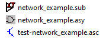
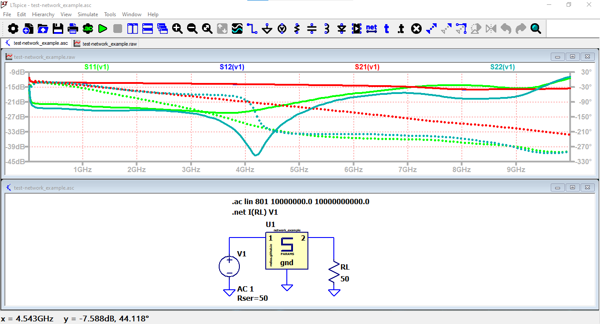

# s2ptoltspice
Converts two-port Touchstone files to **LTspice** subcircuit.

It create: 
- `[name].sub`: The subcircuit
- `[name].asy`: The circuit model. 
- `test-[name].asc`: An LTspice circuit example where is used the circuit model.


```
usage: s2ptoltspice.exe [-h] [--version] [--overwrite] [--silent] s2p_file

This program processes a S2P Touchstone file, and generate a LTspice model

positional arguments:
  s2p_file     The S2P Touchstone file to be processed

options:
  -h, --help   show this help message and exit
  --version    Show program's version number and exit
  --overwrite  If specified, will overwrite existing files without asking
               (default: False)
  --silent     If specified, suppress all output messages (default: False)
```

## Example

```
>s2ptoltspice.exe network_example.s2p
Processing file: network_example.s2p
Write network_example.sub
Write network_example.asy
Write test-network_example.asc
```



